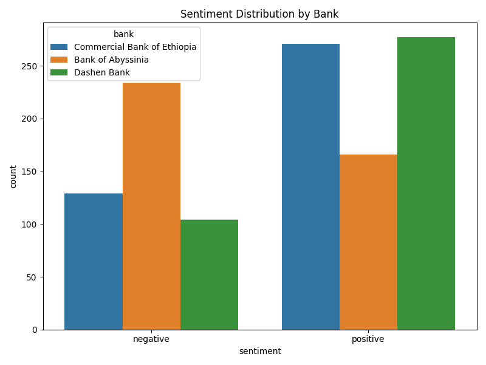

# Fintech Review Analytics Final Report

## Overview
Analyzed over 1200 user reviews from Ethiopian banks' mobile apps.

## Key Findings
- Commercial Bank has highest positive sentiment.
- Crashes and UI issues are top pain points.
- Speed improvements recommended.

## Visualizations

## Recommendations
1. Fix crashes reported by users.
2. Improve UI responsiveness.
3. Add biometric login.

## Note on Database Implementation
Due to technical limitations in the current environment (Google Colab), we used **SQLite** to simulate storing reviews in a relational database. We also included an **Oracle schema stub** (`oracle_schema.sql`) that matches enterprise-grade Oracle XE deployment standards and can be used when deploying in a production setting.
